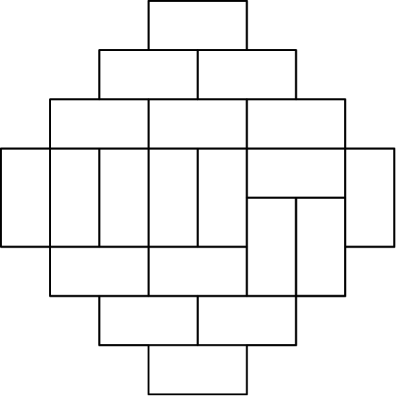
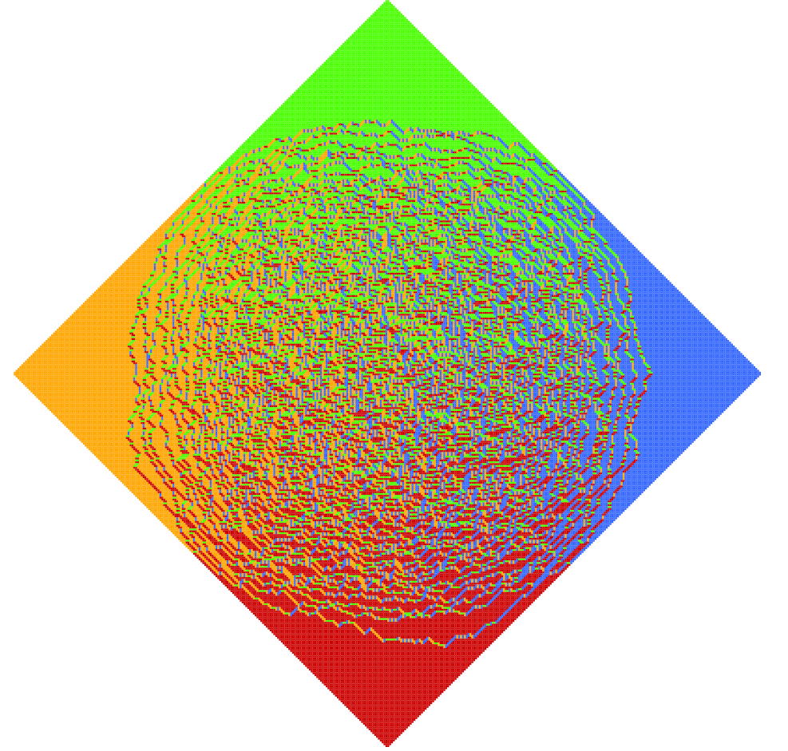

# Aztec Diamond

The motivation for this project was given by the great math-youtube [Mathologer](https://www.youtube.com/channel/UC1_uAIS3r8Vu6JjXWvastJg). Christmas of 2020 - where one naturaly had quite some free time and "I'm going home for Christmas was more of a complaint than a promise - he upload this [video](https://www.youtube.com/channel/UC1_uAIS3r8Vu6JjXWvastJg) (beware very long!).

## Theory
The Aztec diamond of order n, denoted by Az(n), is defined as the union of all the unit squares with integral corners (x, y) satisfying |x| + |y| ≤ n + 1. A domino is simply a 1-by-2 or 2-by-1 rectangles with integral corners. A simple example of a aztec diamond can be seen here:



Tiling with dominos is a well known example of a **pefect matching** of a graph. A perfect matching of a graph is a subset of edges which covers every vertex exactly once,
that is, for every vertex there is exactly one edge in the set with that vertex as endpoint. [This paper](http://www.claymath.org/library/senior_scholars/stanley_ardila_tilings.pdf) gives some low level introduction to tilings. Another famous result of Kasteleyn et al. counts the number of domino tilings of a chessboard (or any other rectangular region). A good introduction can be found [here](https://arxiv.org/pdf/math/0310326.pdf).


[This paper](https://arxiv.org/pdf/math/9801068.pdf) "Random Domino Tilings and the Arctic Circle Theorem" by Jockusch, Propp and Shor studies donino tiling of the Aztec Circle. They show that every such tiling determines a partition of the Aztec diamond into five sub-regions; in the four outer sub-regions, every tile lines up with nearby tiles, while in the fifth, central sub-region, differently-oriented tiles co-exist side by side. While there exist billions of differnt tilings for large diamonds, the largest part of them exhibit this interesting behaviour called the arctic circle. An example of the arctic circle for a Aztec diomond of N = 200 can be seen here:



## Further reads:
- https://en.wikipedia.org/wiki/Aztec_diamond
- http://www.claymath.org/library/senior_scholars/stanley_ardila_tilings.pdf
- http://users.monash.edu/~normd/documents/Mathellaneous-07.pdf
- https://arxiv.org/pdf/math/0412041.pdf
- https://arxiv.org/pdf/math/9201305.pdf
- https://arxiv.org/pdf/math/0310326.pdf
- https://arxiv.org/pdf/math/9801068.pdf


# Algorithm
The aztec-diamond.py srcipt tiles dominos in a random order into a aztec diamond. By doing so you can see the effects of the aztec diamond theory. The "trick" in this case is that we don't actually find all possible tilings, since this would take some time. The number of options scales with $2^{n(n+1)/2}$. For n=20 that is about 2^200 which is around 10^60. For comparisson, the number of Atoms in the universe is around 10^80. So instead of computing all options, you generate a random setting via an expanding scheme. 

The algorithm follows the steps described in this [video](https://youtu.be/Yy7Q8IWNfHM?t=1209).

Example run from source:
```
python aztec_diamond\aztec-diamond.py
```
Runniing saves a file with the resulting picture as "out.html" to this folder.
It also opens the html file in your browser to view.